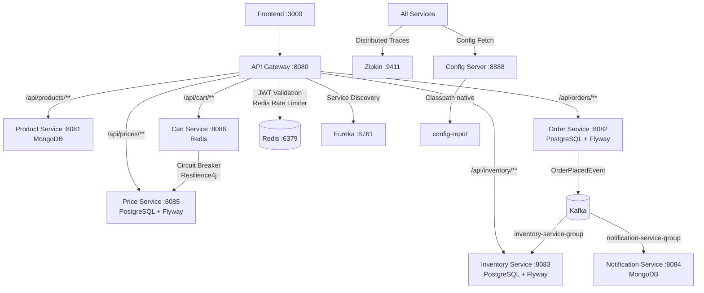

# ShopScale Fabric

A production-grade, event-driven microservices e-commerce platform. Built with Kotlin + Spring Boot backend, React + Vite frontend, API Gateway with JWT auth, Circuit Breakers, distributed Kafka event streaming, and full observability via Zipkin.

---

## Quick Start

> [!IMPORTANT]
> **Docker Desktop (or the Docker Daemon) must be running** before executing these commands. No Java, Maven, or Node is required locally as everything runs containerized.

### Start the Application

To start all services:

```bash
# Windows
.\start.bat

# Mac / Linux
chmod +x start.sh && ./start.sh

# Or directly:
docker compose up --build -d
```

### Stop the Application

To stop and clean up all services:

```bash
docker compose down -v --remove-orphans
```

Once started, access the project via:

> [!TIP]
> 🚀 **Main Frontend Entry Point: [http://localhost:3000](http://localhost:3000)** (Start your review here)

Other developer dashboards and services:

| URL | What it is |
|:---|:---|
| http://localhost:8761 | Eureka Service Registry (all 10 services) |
| http://localhost:9411 | Zipkin Distributed Tracing |
| http://localhost:8080 | API Gateway |

> Allow 2–3 minutes after startup for all services to become healthy.
> Run `docker compose ps` to check readiness.

---

## Architecture



**Key patterns:**
- **Event-Driven Choreography** — Kafka connects Order → Inventory → Notification with zero synchronous coupling
- **Circuit Breaker** — Resilience4j protects Cart → Price (50% threshold, 10-call window, 3-call HALF_OPEN probe)
- **Persistent Storage** — All services backed by real databases; no in-memory state lost on restart
- **Centralized Auth** — JWT validation at Gateway; user identity forwarded as `X-User-Id` header
- **Idempotency** — Inventory Service uses `ProcessedEventJpa` table to prevent duplicate stock deductions
- **Rate Limiting** — Redis token bucket (2 tokens/s replenish, burst 10) per IP at Gateway
- **Observability** — Micrometer Tracing + Zipkin with 100% sampling; structured JSON logs with correlation IDs

---

## Services

| Service | Port | Stack |
|:---|:---|:---|
| `frontend` | 3000 | React + Vite + TypeScript + TailwindCSS |
| `gateway-service` | 8080 | Spring Cloud Gateway + Redis + JWT |
| `product-service` | 8081 | Spring Boot + MongoDB |
| `order-service` | 8082 | Spring Boot + PostgreSQL + Flyway + Kafka |
| `inventory-service` | 8083 | Spring Boot + PostgreSQL + Flyway + Kafka |
| `notification-service` | 8084 | Spring Boot + Kafka + MongoDB |
| `price-service` | 8085 | Spring Boot + PostgreSQL + Flyway |
| `cart-service` | 8086 | Spring Boot + Redis + Resilience4j |
| `eureka-server` | 8761 | Spring Cloud Netflix Eureka |
| `config-server` | 8888 | Spring Cloud Config (native profile) |

**Infrastructure:** Kafka + Zookeeper, PostgreSQL ×3 (orders-db, inventory-db, price-db), MongoDB, Redis, Zipkin

---

## Prerequisites

- Docker Desktop with **≥ 8 GB memory** allocated (Settings → Resources)
- That's it — Java, Maven, and Node are not required

---

## Product Catalog

40 products across 5 categories, all prices in INR:

| Category | Products |
|:---|:---|
| Electronics | MacBook Pro M4, Dell XPS 15, Samsung Galaxy S25 Ultra, Sony WH-1000XM5, Apple Watch Ultra 2, iPad Pro M4, AirPods Pro 2, Kindle Paperwhite |
| Gaming | PlayStation 5, Xbox Series X, Gaming Monitor, Mechanical Keyboard, Gaming Mouse, Gaming Chair, Nintendo Switch OLED, Gaming Headset |
| Smart Living | Smart Watch, Smart LED Lamp, Air Purifier, Smart Security Camera, Smart Speaker, Wireless Charger, Power Bank, Bluetooth Speaker |
| Creator Tools | Stream Deck, Studio Microphone, Mirrorless Camera, SSD Storage, Ring Light Kit, Drawing Tablet, Professional Webcam, Camera Tripod |
| Digital Assets | React SaaS Template, Admin Dashboard Kit, UI Design System, Component Library, Next.js Starter Kit, Figma Design Kit, Mobile UI Kit, Productivity Template Bundle |

---

## Build & Test

```bash
# Run all unit tests + JaCoCo coverage (80% line coverage enforced)
mvn clean verify -DskipITs

# Run E2E tests against a live Docker Compose stack
export TEST_JWT_TOKEN="<valid-jwt>"
mvn verify -Pe2e -Dgroups=e2e -pl e2e-tests

# Build without tests
mvn clean package -DskipTests
```

---

## Test Scenarios

Run these in order after `docker compose up --build -d`.

### Scenario 1 — Happy Path (Full Order Flow)

```bash
TOKEN="<your-test-jwt>"

# Browse products
curl http://localhost:8080/api/products -H "Authorization: Bearer $TOKEN"

# Add to cart
curl -X POST http://localhost:8080/api/cart/user001/items \
  -H "Authorization: Bearer $TOKEN" \
  -H "Content-Type: application/json" \
  -d '{"productId":"prod-001","quantity":1}'

# Place order
curl -X POST http://localhost:8080/api/orders \
  -H "Authorization: Bearer $TOKEN" \
  -H "Content-Type: application/json" \
  -d '{"userId":"user001","paymentMethod":"CREDIT_CARD","shippingAddress":"123 Main St"}'

# Verify trace in Zipkin
sleep 5
curl "http://localhost:9411/api/v2/traces?serviceName=order-service&limit=1"
```

**Expected:** Trace shows spans for `gateway-service` → `order-service` → `inventory-service`.

---

### Scenario 2 — Circuit Breaker (Price Service Failure)

```bash
# Stop Price Service
docker compose stop price-service

# Add to cart — must return 200 with priceAvailable=false (not a 500)
curl -X POST http://localhost:8080/api/cart/user001/items \
  -H "Authorization: Bearer $TOKEN" \
  -H "Content-Type: application/json" \
  -d '{"productId":"prod-001","quantity":1}'

# Check circuit is OPEN
curl http://localhost:8086/actuator/health | python -m json.tool

# Restart Price Service
docker compose start price-service
sleep 30

# Verify circuit recovers to CLOSED
curl http://localhost:8086/actuator/health | python -m json.tool
```

**Expected:** Cart returns `200` with fallback price; CB transitions `CLOSED → OPEN → HALF_OPEN → CLOSED`.

---

### Scenario 3 — Kafka Recovery (Inventory Service Restart)

```bash
# Stop Inventory Service
docker compose stop inventory-service

# Place an order (succeeds — Order Service is decoupled via Kafka)
curl -X POST http://localhost:8080/api/orders \
  -H "Authorization: Bearer $TOKEN" \
  -H "Content-Type: application/json" \
  -d '{"userId":"recovery-user","paymentMethod":"CREDIT_CARD","shippingAddress":"456 Test Rd"}'

# Verify Kafka has pending message (LAG > 0)
docker exec kafka kafka-consumer-groups.sh \
  --bootstrap-server localhost:9092 \
  --describe --group inventory-service-group

# Restart Inventory Service
docker compose start inventory-service
sleep 30

# Verify LAG is now 0 (processed exactly once via idempotency key)
docker exec kafka kafka-consumer-groups.sh \
  --bootstrap-server localhost:9092 \
  --describe --group inventory-service-group
```

**Expected:** LAG drops from > 0 to 0 after restart. Inventory DB decremented exactly once.

---

### Scenario 4 — Rate Limiter (429 Enforcement)

```bash
# Send 105 rapid requests — expect at least 1 to return 429
for i in $(seq 1 105); do
  STATUS=$(curl -s -o /dev/null -w "%{http_code}" \
    http://localhost:8080/api/products \
    -H "Authorization: Bearer $TOKEN")
  echo "Request $i: $STATUS"
done | grep -c "429"
```

**Expected:** At least 1 `429 Too Many Requests` response.

---

### Scenario 5 — JWT Rejection

```bash
curl -v http://localhost:8080/api/products -H "Authorization: Bearer fake.jwt.here"
```

**Expected:** Gateway returns `401` before the request reaches any downstream service.

---

### Scenario 6 — Cart Persistence (Redis)

```bash
# Add item to cart
curl -X POST http://localhost:8080/api/cart/user001/items \
  -H "Authorization: Bearer $TOKEN" \
  -H "Content-Type: application/json" \
  -d '{"productId":"prod-001","quantity":1}'

# Restart cart-service
docker compose restart cart-service
sleep 15

# Verify cart still has the item after restart
curl http://localhost:8080/api/cart/user001 -H "Authorization: Bearer $TOKEN"
```

**Expected:** Cart contents persist across restarts (backed by Redis with TTL).

---

## Swagger UI (Direct Service Access)

| Service | URL |
|:---|:---|
| Product | http://localhost:8081/swagger-ui.html |
| Order | http://localhost:8082/swagger-ui.html |
| Inventory | http://localhost:8083/swagger-ui.html |
| Cart | http://localhost:8086/swagger-ui.html |
| Price | http://localhost:8085/swagger-ui.html |
| Notification | http://localhost:8084/swagger-ui.html |

---

## Environment Variables

| Variable | Default | Purpose |
|:---|:---|:---|
| `JWT_SECRET` | `shopscale-secret-key-...` | Gateway JWT signing key |
| `VITE_API_GATEWAY_URL` | `http://localhost:8080` | Frontend API base URL |
| `TEST_JWT_TOKEN` | — | E2E test token (set for `mvn verify -Pe2e`) |

---

## Troubleshooting

| Problem | Resolution |
|:---|:---|
| Services not in Eureka after 3 min | `docker compose logs <service>` — look for `Config Server not reachable` |
| `Config Server not reachable` | Ensure `config-server` healthcheck passes: `docker compose ps` |
| Kafka timeout on startup | Kafka needs Zookeeper healthy first — check `docker compose ps zookeeper` |
| Port conflict | Stop other local services using ports 8080, 8761, 8888, 9092 |
| Docker OOM | Allocate ≥ 8 GB RAM in Docker Desktop Settings → Resources |
| Cart returns 404 | Verify `VITE_API_GATEWAY_URL` is set and all cart calls use `/api/cart/` prefix |
| Prices showing incorrectly | Ensure price-service PostgreSQL container is healthy: `docker compose ps price-service` |


## Documentation

- [`docs/adr/ADR-001-kafka-order-workflow.md`](docs/adr/ADR-001-kafka-order-workflow.md) — Kafka over REST decision
- [`docs/adr/ADR-002-circuit-breaker-cart-price.md`](docs/adr/ADR-002-circuit-breaker-cart-price.md) — Resilience4j configuration rationale
- [`docs/adr/ADR-003-jwt-gateway-auth.md`](docs/adr/ADR-003-jwt-gateway-auth.md) — JWT-at-gateway pattern
- [`docs/RESILIENCE_RUNBOOK.md`](docs/RESILIENCE_RUNBOOK.md) — How to simulate and verify each failure scenario
